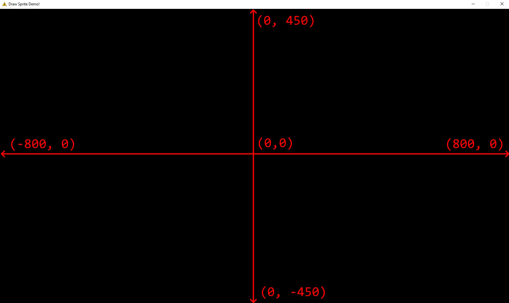
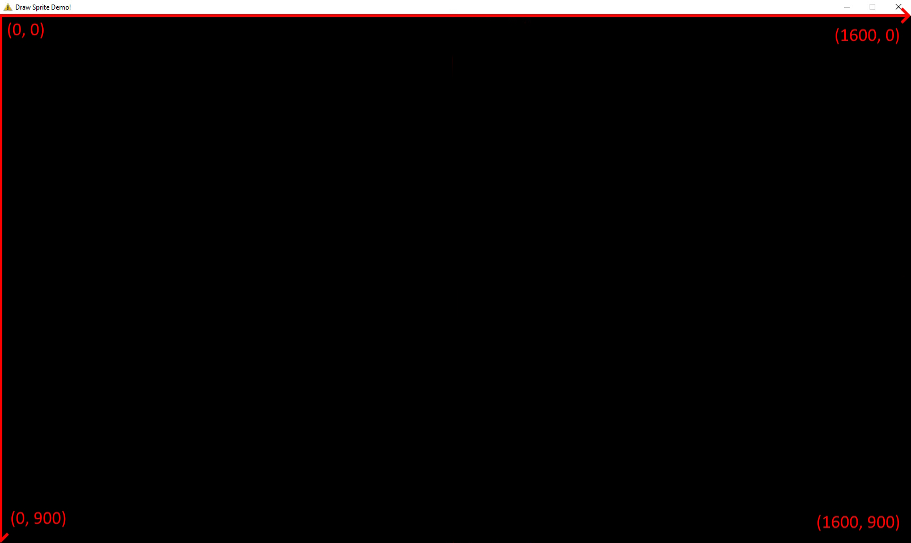
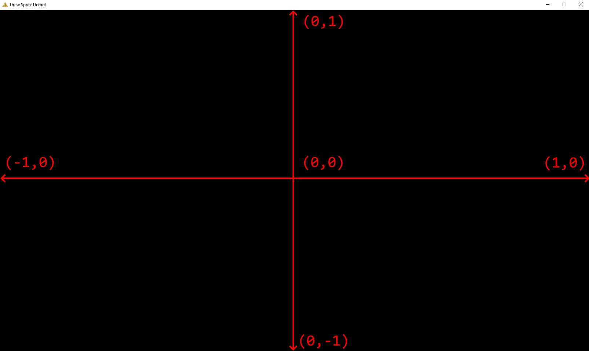

# Coordinate Systems

When programming an application, we work with multiple coordinate systems.
For example, when we render 2D images on the screen, we might use pixel coordinates to describe the sizes and positions of the images. 
However, when we create a user interface (UI), we may use percentages to describe a UI element's size and position on the screen in order to cater for multiple screen sizes.

Therefore, it is important to be aware of the difference spaces you have to work and, when needed, convert between them.

Depending on the complexity of your application, you can have as few as 1 coordinate system to as many as you need.
In Alpha Engine, there are 3 coordinate systems used.
They are: World Coordinates, Screen Coordinates, Normalized Screen Coordinates.

## World Coordinates

Alpha Engine uses the World Coordinates to render the instances of your meshes.
It has the following attributes:

* The origin is in the middle.
* The x-axis goes horizontally towards the right.
* The y-axis goes vertically upwards. 
* For both axes, each unit is 1 pixel wide. 

Assuming a 1600x900 resolution, it follows the diagram below:

For more information on how to render a mesh in World Coordinates, check out the [sprite rendering section](./rendering_sprites.md). 

## Screen Coordinates

Alpha Engine uses Screen Coordinates for elements that that live on the monitor, in terms of monitor pixels.
A function that uses Screen Coordiniates is `AEInputGetCursorPosition()`, which gets the mouse cursor's position on the monitor.
It has the following attributes:

* The origin is in the top left hand corner of the renderable area of your application window. 
* The x-axis goes horizontally towards the right.
* The y-axis goes vertically downwards.
* For both axes, each unit is 1 pixel wide. 

!!! warning

    Since a monitor is made up of concrete pixels, there is no such thing as a half-pixel position. For example, there is no such thing as a mouse position at x = 1.5.

Assuming a 1600x900 resolution, it follows the diagram below:

## Normalized Coordinates

Alpha Engine uses Normalized Coordinates for [rendering text](./rendering_text.md).
The Normalized Coordinates describes the application window in terms of percentage.
It has the following attributes:

* The origin is at the middle of the screen.
* The x-axis goes horizontally towards the right, with 1.0 being the rightmost side of the window and -1.0 being the leftmost side of the window.
* The y-axis goes vertically upwards, with 1.0 being the top of the screen and -1.0 being the bottom of the screen.

!!! note

    Normalized coordinates can be useful for describing position and size of an element because its values are not dependant on the screen resolution. This means that x = 1.0 always describes that right side of the window, whether the window is in 800x600, 1600x900 or 1920x1080 resolution.

