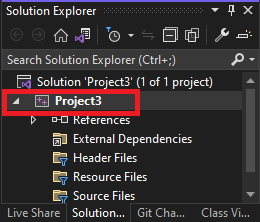
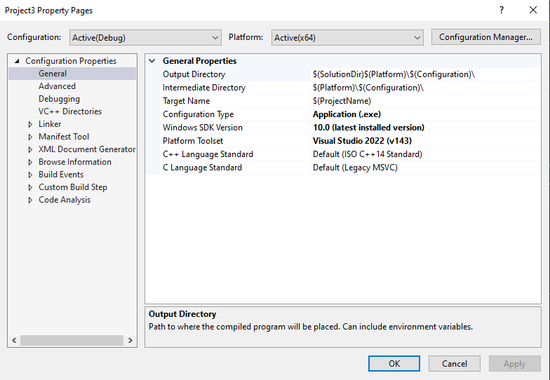
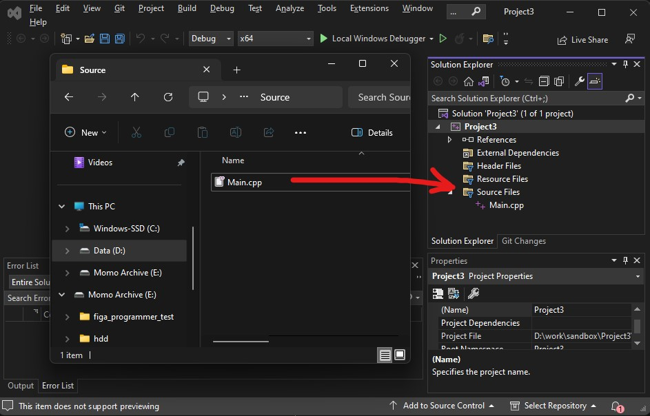

# Project Setup

In this section, we will cover how to create a new Visual Studios 2022 project in Alpha Engine. 

Be sure to [download Assets here](res/Assets.zip) and the Alpha Engine library on Moodle before continuing.

## Project Creation

First, we will create the Visual Studios Solution and Project files that will be used to run our first application.

* Open Visual Studios. You should see a window that looks like this:

* Under the `Visual Studio 2022` window:
    * Click on `Create a new project`
* Under the `Create a new project` window:
    * Click on `Empty Project`. Make sure that it's the C++ version. 
    * Click on `Next`.
* Under the `Configure your new project` page:
    * (Optional) Change the `Project Name` to one of your liking.
    * (Optional) Change the **Location**.
    * Uncheck `Place solution and project in the same directory`.
    * Note the **Location** as we need to navigate to it later.
    * Click on `Create`.

You should see Visual Studios appear on your screen, like so:

This means that it has successfully created and opened.

In this project, we will not be building for 32-bit systems, so to avoid confusion, we need to remove 32-bit system-related configurations from the project.

*	Under `Build` > `Configuration Manager` 
    * Click on `Active Solution Platform` > `Edit…` > Click on `x86` > `Remove`
    * Click on `Platform` > `Edit…` > Click on `Win32` > `Remove`

## Adding a folder for Alpha Engine and assets

Next, we will add the Alpha Engine library to a location within the project folder. 
This is so that our project can easily locate Alpha Engine’s header and library files, and subsequently use its code.

* Go to the project’s Solution File (.sln) using Windows Explorer. It should be at the **Location** that you set earlier.
* Create a folder named `Extern` at that location.
* Create a folder named `Assets` at that location.
* Copy the AlphaEngine folder in the given AlphaEngine.zip file into the `Extern` folder.
* Copy the contents in the given `Assets.zip` file into the `Assets` folder.

## Project Configuration
Next, we configure the project properties. Right-click on the project in the Solution Explorer:

Then click on `Properties`. 
It should open a window that looks something like this:

This window contains all configurations of the project. By default, all projects in VS2022 come with two configurations to compile the app: `Debug` and `Release`.

In general, `Debug` builds are easier to debug but slower. `Release` builds are most optimized but are harder to debug.

Set the `Configuration` drop down bar to `All Configurations`. This will cause our settings to affect both `Debug` and `Release` versions of our application. 

Add the additional directories the compiler needs to look for when compiling and linking:

*	Under `Configuration Properties` > `VC++ Directories`
    *	Add `$(SolutionDir)Extern\AlphaEngine\include` to `General` > `Include Directories`
    *	Add `$(SolutionDir)Extern\AlphaEngine\lib` to `General` > `Library Directories`

!!! warning

    When you add an entry into a section, you have to seperate each entry with ';'. For example, if the entry for `Include Directories` is: `$(VC_IncludePath);$(WindowsSDK_IncludePath)`, to add `$(SolutionDir)Extern\CProcessing\include`, you will have to do: `$(VC_IncludePath);$(WindowsSDK_IncludePath);$(SolutionDir)Extern\CProcessing\include`

Configure the character set the project is using.

*	Under `Configuration Properties` > `Advanced` > `Character Set`
    *	Set to `Use Multibyte Set`

Configure the subsystem the project is using.

*	Under `Configuration Properties` > `Linker` > `System` > `Subsystem`
    *	Set to `Windows (/SUBSYSTEM:WINDOWS)`

Set the output directory of the compiler where the executable will be created. 
We will set this to a folder named `bin` at the directory the Solution file is in:

*	Under `Configuration Properties` > `General` > `Output Directory`
    *	Set to `$(SolutionDir)bin\$(Configuration)-$(Platform)\`

Set the intermediate directory of the compiler. 
This is where all the 'rubbish' files that the compiler generates will go to.  
We will set this to a folder named ".tmp" at the directory the Solution file is in:

*	Under `Configuration Properties` > `General` > `Intermediate Directory`
    * Set to `$(SolutionDir).tmp\$(Configuration)-$(Platform)\`

Set the working directory of the debugger to be in the same directory as the executables output by the compiler:

*	Under `Configuration Properties` > `Debugging`  > `Working Directory`
    * Set to `$(SolutionDir)bin\$(Configuration)-$(Platform)\`

!!! warning

    For the next few steps, you might need to change the `Configuration` drop down to either `Debug` to `Release`. Follow the steps carefully!

Configure the linker to link to the appropriate Alpha Engine depending on whether we are on Debug or Release configurations:

* Click on `Configuration Properties` > `Linker` > `Input` > `Additional Dependencies`
    *	With `Configuration` set to `Debug`:
        * Click on the `v` arrow at the right side of the text field to toggle a dropdown menu
        * Click on `<Edit...>`. A window should appear.
        * Add `Alpha_EngineD.lib`. 
        * Click on `OK` to close the window.
        * Click on `Apply`
    *	With `Configuration` set to `Release`
        * Click on the `v` arrow at the right side of the text field to toggle a dropdown menu
        * Click on `<Edit...>`. A window should appear.
        * Add `Alpha_Engine.lib`
        * Click on `OK` to close the window.
        * Click on `Apply`

<video width="100%" controls>
    <source src = "res/vs2022_additional_dependencies.mp4">
</video>

Tell Visual Studios to copy the appropriate .dll and assets to where the executable is after it's built:

*	Under `Configuration Properties` > `Build Events` > `Post-Build Event` > `Command Line` > `Edit…`
    * With `Configuration` set to `Debug`:
        * Click on the `v` arrow at the right side of the text field to toggle a dropdown menu
        * Click on `<Edit...>`. A window should appear.
        *	Add `xcopy "$(SolutionDir)Assets\" "$(OutDir)Assets\" /s /r /y /q`
        *	Add `xcopy "$(SolutionDir)Extern\AlphaEngine\lib\freetype.dll" "$(OutDir)" /s /r /y /q`
        *	Add `xcopy "$(SolutionDir)Extern\AlphaEngine\lib\Alpha_EngineD.dll" "$(OutDir)" /s /r /y /q`
        *	Add `xcopy "$(SolutionDir)Extern\AlphaEngine\lib\fmodL.dll" "$(OutDir)" /s /r /y /q`
        * Click on `OK` to close the window.
        * Click on `Apply`
    * With `Configuration` set to `Release`:
        * Click on the `v` arrow at the right side of the text field to toggle a dropdown menu
        * Click on `<Edit...>`. A window should appear.
        *	Add `xcopy "$(SolutionDir)Assets\" "$(OutDir)Assets\" /s /r /y /q`
        *	Add `xcopy "$(SolutionDir)Extern\AlphaEngine\lib\freetype.dll" "$(OutDir)" /s /r /y /q`
        *	Add `xcopy "$(SolutionDir)Extern\AlphaEngine\lib\Alpha_Engine.dll" "$(OutDir)" /s /r /y /q`
        *	Add `xcopy "$(SolutionDir)Extern\AlphaEngine\lib\fmod.dll" "$(OutDir)" /s /r /y /q`
        * Click on `OK` to close the window.
        * Click on `Apply`

<video width="100%" controls>
    <source src = "res/vs2022_post_build.mp4">
</video>

## Running our first application 

Create a fresh CPP file with the entry point function and name it `Main.cpp`.

* Open File Explorer and navigate to the project's directory.
* Create a folder there to hold all our code. For this example, we will name the folder `Source`
* Go into the `Source` folder and create a file named `Main.cpp`. This will contain the code with the entry point to our application.
* Drag and drop `Main.cpp` from the File Explorer into the Source File filter in Visual Studios 2022.

* Copy the code from the given `snippets\barebones.cpp` into the `Main.cpp` file that you just created.
* Build and run the project.
* You should see a blank window with the title "My New Demo" pop up with a console window at the back. The problem should close upon pressing the escape key.

If you got here, congratulations! You have set up Alpha Engine!

!!! note
    
    If you are new to Visual Studios, it is recommended to follow these steps to add a new source file into Visual Studios. This will at least keep our source files organized into a folder, rather than all over the project. If you have a better idea on how you want to organize your source files, feel free to do so!
