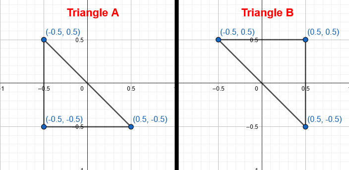
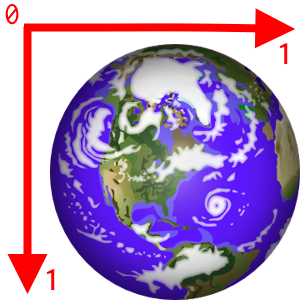
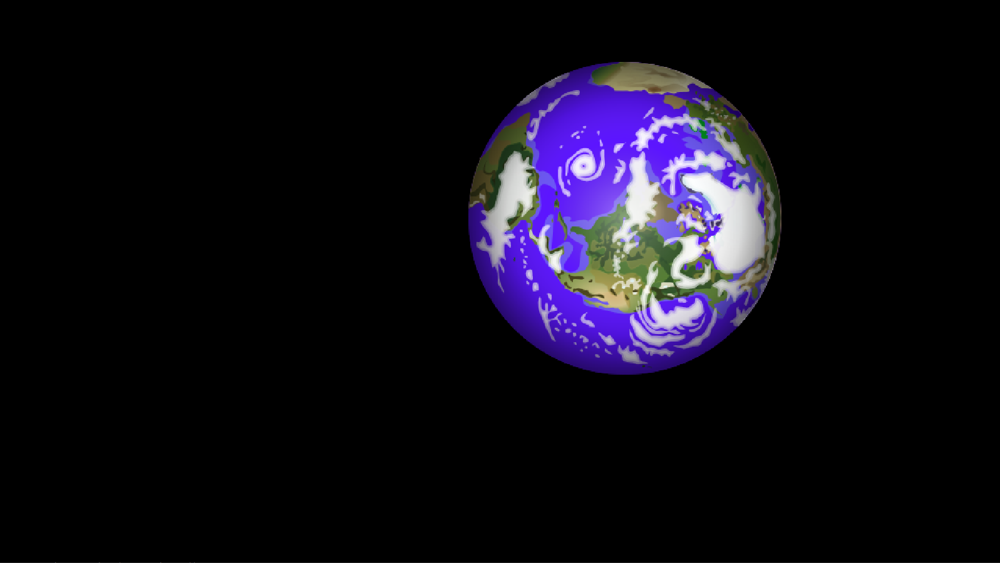
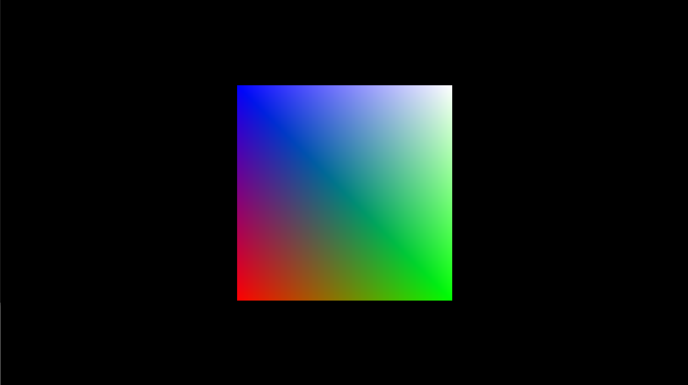

# Rendering A Sprite

In this section, we will cover the basics of rendering something on the screen with Alpha Engine. 
In Alpha Engine, rendering something on the screen goes through similar steps as rendering something using a graphics API like OpenGL, DirectX and Vulkan. 
Alpha Engine simplifies the steps so that you don’t have to manage the underlying details.

The steps are generally as follows:

* Create a Mesh (sometimes called a Model) on initialization. A Mesh is just a collection of triangles, which are a collection of 3 vertices. 
You can of a Mesh as a blueprint, which we can create clones of to draw on the screen. 
* In the game loop:
    * Set various settings in Alpha Engine to tell it how you want to draw the Mesh. For example:
        * What transform to apply to all vertices of the mesh.
        * What texture to apply onto the mesh.
        * ...and more!
    * Inform Alpha Engine to draw a mesh based on the settings provided in the previous step.

In the following sections, we detail the steps to render a few simple sprites. 
A sprite in computer graphics is a 2 dimensional image that is rendered somewhere within our window. 

## Creating a 1x1 mesh

For most implementation of sprites, you can get away with a single 1x1 white square mesh that is centered around the origin.


In modern graphics implementations, our meshes are made up of triangles. 
A square mesh can be made out of 2 triangles.
A triangle is made up of 3 vertices.
There are a few ways to arrange two triangles to form a square but we will use these values for this example:


$$
\triangle A = \begin{bmatrix} -0.5 \\ -0.5 \end{bmatrix}, \begin{bmatrix} -0.5 \\ 0.5 \end{bmatrix}, \begin{bmatrix} 0.5 \\ -0.5 \end{bmatrix}
$$

$$
\triangle B = \begin{bmatrix} 0.5 \\ -0.5 \end{bmatrix}, \begin{bmatrix} 0.5 \\ 0.5 \end{bmatrix}, \begin{bmatrix} -0.5 \\ 0.5 \end{bmatrix}
$$



XY coordinates are not the only things that a vertex can store.
In theory, a vertex store as many addiional information you want!
In Alpha Engine, a vertex can store the following information:

* XY Coordinates 
* Color
* UV Coordinates

Color is irrelevant for this section, so we will ignore it for now.
It will be covered in [a later section](./rendering_sprites.md#colors-and-color-modification).

The next thing we need to talk about is UV Coordinates.

UV coordinates are coordinates of an image, which are rectangular in nature. 
In Alpha Engine, U represents the X-axis of an image going from left to right, while V represents the Y axis of an image going from top to bottom. 
The origin is at the top-left hand portion of the image.
Both U and V values range from 0.0 to 1.0. 
This means that the bottom-right of an image has the coordinates U = 1.0 and V = 1.0. 




To ensure that our renderer applies the image onto our mesh correctly, we need to map the correct UV coordinates to each vertex of our mesh. 

Given that the XY coordinates of each of our vertices represents a corner, we simple map a UV coordinate that corresponds to that corner of the image to the vertex. 

This means that we will map the vertex that represents the top-left corner of our mesh to the UV coordinate that represents the top-left of the image, the bottom-right vertex to the UV coordinates that represents the bottom-right of the image, and so on.

The code below will create a square mesh of 1 pixel width and height centered around the origin and store it under `pMesh`. 
Do this *BEFORE* the game loop. 

!!! warning 
    
    Do not create a mesh within the game loop! We don't want to create a mesh each frame!

```c
// We inform Alpha Engine that we are going to create a mesh
AEGfxMeshStart();

// AEGfxTriAdd() takes in 3 sets of 5 parameters,
// totalling to a whooping 15 parameters to input.
//
// Each set represents a vertex, and with three sets
// we form a single triangle. 
// 
// The 5 parameters in a set are:
// - A vertex's x value
// - A vertex's y value
// - A vertex's color in hexadecimal
// - The U value of a texture to map to this vertex
// - The V value of a texture to map to this vertex

// The code below tells Alpha Engine that the mesh will contain 2 
// triangles that makes up a white square. 
//
// Notice that this 1x1 white square is centered around the origin.
//

AEGfxTriAdd(
  -0.5f, -0.5f, 0xFFFFFFFF, 0.0f, 1.0f,
  0.5f, -0.5f, 0xFFFFFFFF, 1.0f, 1.0f,
  -0.5f, 0.5f, 0xFFFFFFFF, 0.0f, 0.0f);

AEGfxTriAdd(
  0.5f, -0.5f, 0xFFFFFFFF, 1.0f, 1.0f,
  0.5f, 0.5f, 0xFFFFFFFF, 1.0f, 0.0f,
  -0.5f, 0.5f, 0xFFFFFFFF, 0.0f, 0.0f);

// Saving the mesh (list of triangles) in pMesh
AEGfxVertexList * pMesh = AEGfxMeshEnd();
```

After you are done with the Mesh, remember to free it *AFTER* the game loop *BEFORE* the application exits with:


```c
// This will free the Mesh.
AEGfxMeshFree(pMesh);
```

## Loading A Texture

Loading a texture is straightforward. 
The code below will load a texture located in our Assets folder and store it under `pTex`:


```c
// This will load a texture in `Assets/PlanetTexture.png` 
// and store it in pTex. 
AEGfxTexture* pTex = AEGfxTextureLoad("Assets/PlanetTexture.png");
```

After you are done with the Texture, remember to free it *AFTER* the game loop *BEFORE* the application exits:

```c
// 'Frees' the texture.
AEGfxTextureUnload(pTex);
```

## Calculating the transformation matrix

Our next step is to calculate a transformation matrix that will be applied to every vertex of our mesh. 
In our example, let's say we want a sprite that is:

* Scaled 500 pixels width and height 
* Rotated by 90 degrees anti-clockwise
* Translated 200 pixels along the x-axis and 100 along the y-axis

To calculate the transformation matrix $F$ for this, it's a simple case of concatenating the scale, rotation and translation matrices in that order.

$$
F =
\begin{bmatrix}
1 & 0 & t_x \\
0 & 1 & t_y \\
0 & 0 & 1
\end{bmatrix}
\begin{bmatrix}
\cos(r) & -\sin(r) & 0 \\
\sin(r) & \cos(r) & 0 \\
0 & 0 & 1
\end{bmatrix}
\begin{bmatrix}
s_x & 0 & 0 \\
0 & s_y & 0 \\
0 & 0 & 1
\end{bmatrix}
$$

Where:

* $t_x, t_y$ represents our translation along the x and y axis respectively.
* $s_x, s_y$ represents our scale along the x and y axis respectively.
* $r$ represents the angle of anticlockwise rotation in radians. 

Thus, substituting the values we want in, we should get the following matrices:


$$
F =
\begin{bmatrix}
1 & 0 & 200 \\
0 & 1 & 100 \\
0 & 0 & 1
\end{bmatrix}
\begin{bmatrix}
\cos(\frac{\pi}{2}) & \sin(\frac{\pi}{2}) & 0 \\
\sin(\frac{\pi}{2}) & \cos(\frac{\pi}{2}) & 0 \\
0 & 0 & 1
\end{bmatrix}
\begin{bmatrix}
500 & 0 & 0 \\
0 & 500 & 0 \\
0 & 0 & 1
\end{bmatrix}
$$

Now that we know how to form our transformation matrix, we need to translate that into code. 
Below is a snippet on how to do it in Alpha Engine.

```c
// Create a scale matrix that scales by 500 x and y
AEMtx33 scale = { 0 };
AEMtx33Scale(&scale, 500.f, 500.f);

// Create a rotation matrix that rotates by 90 degrees
// Note that PI in radians is 180 degrees.
// Since 90 degrees is 180/2, 90 degrees in radians is PI/2
AEMtx33 rotate = { 0 };
AEMtx33Rot(&rotate, PI/2);

// Create a translation matrix that translates by
// 200 in the x-axis and 100 in the y-axis
AEMtx33 translate = { 0 };
AEMtx33Trans(&translate, 200.f, 100.f);

// Concatenate the matrices into the 'transform' variable.
// We concatenate in the order of translation * rotation * scale
// i.e. this means we scale, then rotate, then translate.
AEMtx33 transform = { 0 };
AEMtx33Concat(&transform, &rotate, &scale);
AEMtx33Concat(&transform, &translate, &transform);
```

Note that this is just a way to put together a transformation matrix that will be used to render a sprite in our example.
Alpha Engine doesn't care about how you form the transformation matrix; it just uses the final matrix you give it. 

## Putting it all together to render a sprite

At this stage you should have the following ready:

* The transformation matrix that you will use to apply to all vertices of a mesh.
* The texture to apply onto the mesh.
* The mesh to be used to draw after applying the transformation matrix and texture.

The code below shows how to configure the rendering settings and draw a single sprite using the mesh, transform and texture we prepared in the previous sections.
Ideally, the code should be placed within the game loop. 

```c
// Tell the Alpha Engine to set the background to black.
AEGfxSetBackgroundColor(0.0f, 0.0f, 0.0f);

// Tell the Alpha Engine to get ready to draw something with texture.
AEGfxSetRenderMode(AE_GFX_RM_TEXTURE);

// Set the the color to multiply to white, so that the sprite can 
// display the full range of colors (default is black).
AEGfxSetColorToMultiply(1.0f, 1.0f, 1.0f, 1.0f);

// Set the color to add to nothing, so that we don't alter the sprite's color
AEGfxSetColorToAdd(0.0f, 0.0f, 0.0f, 0.0f);

// Set blend mode to AE_GFX_BM_BLEND, which will allow transparency.
AEGfxSetBlendMode(AE_GFX_BM_BLEND);
AEGfxSetTransparency(1.0f);

// Tell Alpha Engine to use the texture stored in pTex
AEGfxTextureSet(pTex, 0, 0);

// Tell Alpha Engine to use the matrix in 'transform' to apply onto all 
// the vertices of the mesh that we are about to choose to draw in the next line.
AEGfxSetTransform(transform.m);

// Tell Alpha Engine to draw the mesh with the above settings.
AEGfxMeshDraw(pMesh, AE_GFX_MDM_TRIANGLES);
```

You should see a sprite with the image from PlanetTexture.png drawn on the screen, scaled to 500x500 pixels, rotated by 90 degrees and translated by 100 on the x-axis and 100 on the y-axis like so:



The completed minimal code to render the sprite above can be found `snippets/rendering_a_sprite.png`.


## Exercise: Transformation

As an exercise, try to do the following:

* Draw 3 planets with varying sizes. Let's name the planets A, B and C.
    * Note that they should use the same mesh. Feel free to have different textures if you want.
* Planet A: Stay in the middle of the screen, rotating about itself.
* Planet B: Rotates around Planet A, while also rotating about itself
* Planet C: Rotates around Planet B, while also rotating about itself.

The solution for this can be found in `snippets\solar_system.cpp`.
For more information related to graphics, check out the documentation surrounding the `AEGraphics.h` file.

## Colors and Color Modification

For each sprite you choose to render, Alpha Engine has to decide what color to assign each pixel (or fragment) of your sprite. 
If we use a texture, Alpha Engine does the heavy lifting of deciding which part of the texture corresponds to which pixel of the sprite. 

In Alpha Engine, each pixel is represented by 4 color components: Red, Green, Blue and Alpha.
Each color component are floating point values that range from 0.0 to 1.0, where 0 means 0% and 1 means 100%.
The values representing the Red, Green and Blue components should be straightforward; 1.0 red means 100% red, 0.5 blue mean 50% blue, and so forth. 
The value on the Alpha component refers to transparency of the pixel, where 0.0 is not visible and 1.0 is fully opaque.

Alpha Engine has support for multiplying and adding values to every color component for each pixel of your sprite before rendering them.

Using these functions will enable us to create interesting effects with our sprite. 

To add colors, we use `AEGfxSetColorToAdd()`.
The concept of adding colors is straightforward; we are simply asking Alpha Engine to add each color component of every pixel of the sprite with the values we set.
For example, if we use the code from the <<render_sprite>> section and set `AEGfxSetColorToAdd()` such that we add 100% red: 

```c
AEGfxSetBackgroundColor(0.0f, 0.0f, 0.0f);
AEGfxSetRenderMode(AE_GFX_RM_TEXTURE);
AEGfxSetColorToMultiply(1.0f, 1.0f, 1.0f, 1.0f);

// Add more red!!
AEGfxSetColorToAdd(1.0f, 0.0f, 0.0f, 0.0f);

AEGfxSetBlendMode(AE_GFX_BM_BLEND);
AEGfxSetTransparency(1.0f);
AEGfxTextureSet(pTex, 0, 0);
AEGfxSetTransform(transform.m);
AEGfxMeshDraw(pMesh, AE_GFX_MDM_TRIANGLES);
```

The sprite will end up looking like this:


!!!tip
    
    Note that the transparent part of the sprite remains transparent!

Multiplying can be done using `AEGfxSetColorToMultiply()`. 
The concept of multiplying colors is also straightforward; we are asking Alpha Engine to multiply each color component of every pixel of the sprite with the values we set.
For example, if we use the code from [before](rendering_sprites.md#putting-it-all-together-to-render-a-sprite) and set `AEGfxSetColorToAdd()` such that we multiply with 200% red: 

```c
AEGfxSetBackgroundColor(0.0f, 0.0f, 0.0f);
AEGfxSetRenderMode(AE_GFX_RM_TEXTURE);

// Multiply all red by 200%!!
// Multiply the rest by 100% so that the colors for 
// the rest of the components remain the same!
AEGfxSetColorToMultiply(2.0f, 1.0f, 1.0f, 1.0f);

AEGfxSetColorToAdd(0.0f, 0.0f, 0.0f, 0.0f);
AEGfxSetBlendMode(AE_GFX_BM_BLEND);
AEGfxSetTransparency(1.0f);
AEGfxTextureSet(pTex, 0, 0);
AEGfxSetTransform(transform.m);
AEGfxMeshDraw(pMesh, AE_GFX_MDM_TRIANGLES);
```

The sprite will end up looking like this:


These are just simple use cases for adding and multiplying colors to your sprites.
You are highly encouraged to experiment and come up with unique interesting color effects of your own!

## Sprites without textures

Recall [that we created a 1x1 mesh](rendering_sprites.md#creating-a-1x1-mesh) using `AEGfxTriAdd` and skipped explaining the color parameter. 
In this section, we will be talking about that parameter, which can be useful if you don't have a texture to work with.

The color parameter for each vertex is represented using 32-bits (or 4 bytes), with each byte representing a color component ranging from 0 to 255.

There are many ways to represent colors in this way. 
In Alpha Engine, we use the ARGB format, where A means alpha, R means red, G means green and B means blue. 
This means that the first byte represents alpha, the second byte represents red, third byte represents green and fourth byte represents blue.

The easiest way to visualize this is to use the hexidecimal format, where 0 is `00` and 255 is `FF`, like so:

```c
u32 color = 0xFFFFFF00;
//                  ^^ blue
//                ^^ green
//              ^^ red
//           ^^ alpha
//
// This means that there is 255 alpha, 255 red, 255 green and 0 blue.
// This represents an opaque yellow color. 
//
```

Each vertex on a mesh can be given a color in this format.
Let's set the vertices of [our 1x1 mesh](./rendering_sprites.md#creating-a-1x1-mesh) with different color:

```c
// We inform Alpha Engine that we are going to create a mesh
AEGfxMeshStart();

// This time, we will look at the 3rd parameter of each line 
// (namely, the 3rd, 8th and 13th parameters).
// 
//  

AEGfxTriAdd(
  -0.5f, -0.5f, 0xFFFF0000, 0.0f, 1.0f,  // bottom-left: red
  0.5f, -0.5f, 0xFF00FF00, 1.0f, 1.0f,   // bottom-right: green
  -0.5f, 0.5f, 0xFF0000FF, 0.0f, 0.0f);  // top-left: blue

AEGfxTriAdd(
  0.5f, -0.5f, 0xFF00FF00, 1.0f, 1.0f,   // bottom-right: green
  0.5f, 0.5f, 0xFFFFFFFF, 1.0f, 0.0f,    // top-right: white
  -0.5f, 0.5f, 0xFF0000FF, 0.0f, 0.0f);  // top-left: blue

// Saving the mesh (list of triangles) in pMesh
AEGfxVertexList * pMesh = AEGfxMeshEnd();
```

Next, we need to change the render mode to `AE_GFX_RM_COLOR` before using `AEGfxMeshDraw()`.
This informs Alpha Engine that we are not using the UV coordinates or a texture to draw our mesh, instead using the color values we set for each vertex of our mesh.

```c
// Change to AE_GFX_RM_COLOR
// AEGfxSetRenderMode(AE_GFX_RM_TEXTURE);
AEGfxSetRenderMode(AE_GFX_RM_COLOR);

//
// Other settings here...
//

// Draw the mesh 
AEGfxMeshDraw(pMesh, AE_GFX_MDM_TRIANGLES);
```


This will result in something like this:



Notice that the colors will interpolate across the surface when it goes from one vertex to another!
