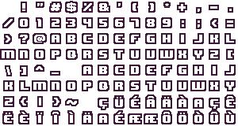
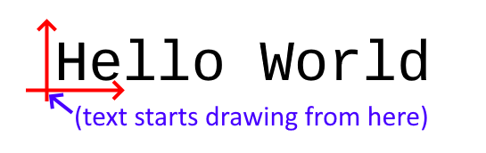

# Rendering Text

In Alpha Engine, text rendering is a special component within the Graphics Module. 

There are 4 functions that is related to text rendering:

* AEGfxCreateFont()
* AEGfxDestroyFont()
* AEGfxPrint()
* AEGfxGetPrintSize()

## Loading and unloading fonts 

Before we can print text on the screen, we first need to load the font.
Do this *before* the game loop.

```c
//
// Loads a font and prepares it at a font height of 72 pixels.
//
// Note that it returns a s8, which is something like a "handle"
// to the font managed by Alpha Engine.
//
s8 pFont = AEGfxCreateFont("Assets/liberation-mono.ttf", 72);
```

The code above loads a TrueType font file from `Assets/liberation-mono.ttf` and prepares it to be rendered with a base font-height of 72 pixels. 
Internally, Alpha Engine will prepare something like a spritesheet (a.k.a altas) of characters from the font file, which each character a font height of 72 pixels.



Currently, Alpha Engine will prepare characters from the ASCII value 32 to 127.

To unload a font, simply use `AEGfxDestroyFont()`:

```c
// Releases resources used by a font
AEGfxDestroyFont(pFont);
```

## Printing text

Printing text one the screen is a simple matter of using `AEGfxPrint()`. 
The code below will print white "Hello World" text starting from the middle of the window at 72px font height (assume that you loaded the font at 72px font-height).

```c
// Put this code between AESysFrameStart() and
// AESysFrameEnd(), of course! 
AEGfxPrint(pFont,           // font handle given by AEGfxCreateFont()
           "Hello World",   // null-terminated c-string to print
           0.f,             // x position on normalized coordinates, ranging from -1.f to 1.f 
           0.f,             // y position in normalized coordinates, ranging from -1.f to 1.f 
           1.f,             // how much to scale the text by 
           1.f,             // percentage of red, ranging from 0.f to 1.f 
           1.f,             // percentage of green, ranging from 0.f to 1.f
           1.f,             // percentage of blue, ranging from 0.f to 1.f 
           1.f);            // percentage of alpha, ranging from 0.f to 1.f
```

!!! warning 
    
    Be aware that the 3rd and 4th parameters are x and y positions in Normalized Coordinates, which is covered [in this section](./coordinate_systems.md#normalized-coordinates). 

You might notice that even though we told Alpha Engine to draw from the middle of the screen, the text did not end up aligned nicely in the middle.
This is because Alpha Engine draws the text starting from the bottom-left side.



Although you cannot change the way Alpha Engine renders text, you can use `AEGfxGetPrintSize()` help simluate text vertical alignment and justification.

Below is a snippet of code that will print "Hello World" text directly in the middle, with center justification and middle vertical alignment:

```c
// Draws text that is neatly aligned to the center of the window.
const char* pText = "Hello World";
f32 width, height;
AEGfxGetPrintSize(pFont, pText, 1.f, &width, &height);
AEGfxPrint(pFont, pText, -width/2, -height/2, 1, 1, 1, 1, 1);
```

More snippets for text rendering can be found at `snippets/render_text.cpp`.

!!!warning 
    
    Even though these functions are using the `AEGfx` prefix, functions that work on `AEGfxDrawMesh()` like `AEGfxSetTransparency()` or `AEGfxSetTransform()` are not guaranteed to work on them.


