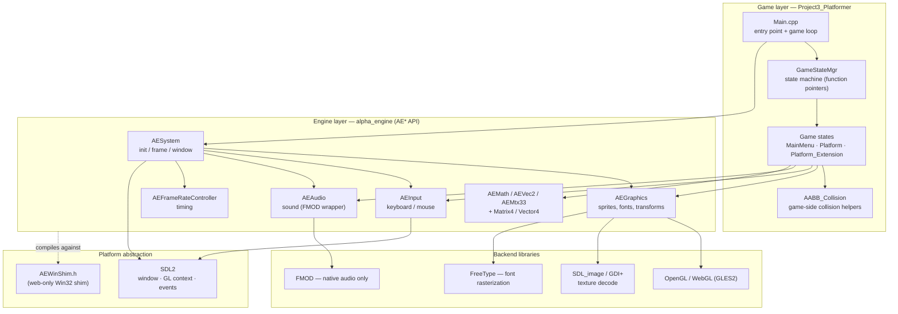
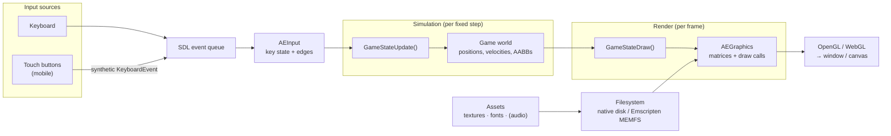
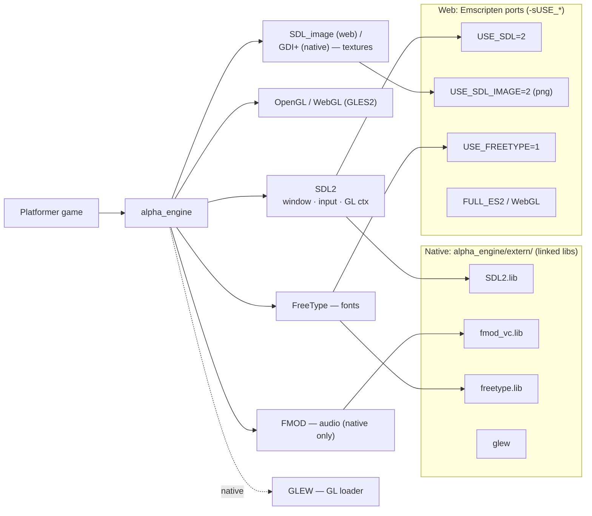

# Software Architecture Document — Alpha Engine Platformer

**Project:** Alpha Engine (C++ 2D engine) + Platformer game, native Windows **and** WebAssembly.
**Status:** Native VS build and Emscripten web build both working; deployed to GitHub Pages.
**Scope of this document:** A high-level architectural overview — the major components, how they communicate, the runtime data flow, and the key dependencies. It is written for someone orienting to the codebase, not as a line-by-line reference.

---

## 1. Overview

The system is a single 2D game (`Project3_Platformer`) built on top of a reusable real-time engine (`alpha_engine`). The same C++ source compiles to two targets from one code path:

- **Native Windows** — built with Visual Studio (`build/mvs2022/`), links the libraries in `alpha_engine/extern/` (SDL2, FMOD, FreeType, GLEW), renders with desktop OpenGL.
- **Web / WebAssembly** — built with Emscripten + CMake + Ninja, uses Emscripten's SDL2 / SDL_image / FreeType *ports*, renders with WebGL (GLES2), runs in the browser on desktop and mobile.

The defining architectural principle is **one source, two targets**: every web-specific divergence is isolated behind `#if defined(__EMSCRIPTEN__)`, so the native build is byte-for-byte unaffected by the port. SDL2 is the common platform abstraction that makes this possible — it owns the OS window, GL surface, and input on both targets.

---

## 2. Layered architecture

The codebase is organized into four layers. Dependencies point downward only; the engine never knows about the game, and game code never calls the platform libraries directly.



**Game layer** — the platformer itself: an entry point, a state manager, the individual game states (menu and levels), and game-specific collision logic. It talks to the world *only* through the engine's `AE*` API.

**Engine layer (`alpha_engine`)** — a C-style API (functions prefixed `AE…`, declared in `AEEngine.h`) split into subsystems: system/lifecycle, graphics, input, audio, frame-rate control, and math. This is the reusable core; the game is just one client of it.

**Platform abstraction** — SDL2 provides the OS window, the OpenGL context, and the input event stream identically on both targets. `AEWinShim.h` supplies the handful of Win32 types and `VK_*` key codes the headers expect, but only when compiling for the web (natively, the real `<windows.h>` is used).

**Backend libraries** — OpenGL/WebGL for rendering, SDL_image (web) / GDI+ (native) for texture decoding, FreeType for font glyphs, and FMOD for audio on native only.

---

## 3. Components and responsibilities

| Component | Files | Responsibility |
|-----------|-------|----------------|
| **Entry point + loop** | `Main.cpp` | Initializes the engine, runs the game loop, drives state transitions, owns the fixed-timestep accumulator. Has two implementations selected at compile time (native `WinMain` vs. web `emscripten_set_main_loop`). |
| **Game State Manager** | `GameStateMgr.{h,cpp}`, `GameStateList.h` | A function-pointer state machine. Holds `curr/prev/next` state IDs and six function pointers (`Load/Init/Update/Draw/Free/Unload`) that `GameStateMgrUpdate()` rebinds to the active state. |
| **Game states** | `GameState_MainMenu`, `GameState_Platform`, `GameState_Platform_Extension` | Each implements the six lifecycle functions. Menu starts/quits; the platform states are the playable levels. |
| **Game collision** | `AABB_Collision.{h,cpp}` | Axis-aligned bounding-box collision used by the platform levels. |
| **AESystem** | `src/AESystem.cpp` | Engine lifecycle: `AESysInit` (creates the SDL window + GL surface, brings up the other subsystems), `AESysFrameStart/End`, event pump (`AESysUpdate`), window title/fullscreen/focus. |
| **AEGraphics** | `src/AEGraphics.cpp`, `AEGraphics.h` | The renderer: meshes/sprites, textures, fonts (via FreeType), transform/camera matrices, background color, vsync. GLES2-style shaders work on both desktop GL and WebGL. |
| **AEInput** | `src/AEInput.cpp`, `AEInput.h` | Keyboard/mouse state with per-frame "pressed / triggered / released" edges. Reads SDL keyboard state; exposes `AEVK_*` virtual-key constants. |
| **AEAudio** | `src/AEAudio.cpp`, `AEAudio.h` | Sound playback. Full FMOD implementation on native; **no-op stubs on web** (FMOD has no web backend). |
| **AEFrameRateController** | `src/AEFrameRateController.cpp` | Frame timing, `AEGetTime()`, delta-time, target frame rate. |
| **AEMath** | `AEMath`, `AEVec2`, `AEMtx33`, `Matrix4`, `Vector4`, `Point4`, `AELineSegment2` | Vectors, 3×3 transform matrices, and geometry helpers used by both the engine and the game. |
| **AEWinShim** | `include/AEWinShim.h` | Web-only: opaque Win32 handle types, `VK_*` codes, `min/max`, `sprintf_s`, so the unchanged headers compile under Emscripten. |

### Global state and coupling

The engine and game communicate through a small set of **global variables** rather than passed-in context objects — typical of this engine's C-style design:

- `gGameStateCurr / Prev / Next` and the six `GameState*` function pointers (game ↔ loop).
- `g_dt`, `g_fixedDT`, `g_appTime` (timing, read by game states each tick).
- `gAESDLWindow`, `gAESysWindowHandle`, `gAEIsFullScreen`, `gAEIsFocus` (engine window state).

This keeps call sites simple but means subsystem ordering and lifetime are managed centrally in `AESystem` and `Main.cpp`.

---

## 4. How the components communicate

```mermaid
sequenceDiagram
    participant Loop as Main loop
    participant Sys as AESystem
    participant GSM as GameStateMgr
    participant State as Active game state
    participant Inp as AEInput
    participant Gfx as AEGraphics
    participant SDL as SDL2 / GL

    Loop->>Sys: AESysInit() (once)
    Sys->>SDL: create window + GL context
    Sys->>Gfx: AEGfxInit()
    Sys->>Inp: AEInputInit()
    Loop->>GSM: GameStateMgrInit(GS_MAINMENU)

    rect rgb(238,244,252)
    note over Loop,State: per state: Load → Init, then the frame loop
    Loop->>GSM: GameStateMgrUpdate() (bind fn pointers)
    Loop->>State: GameStateLoad() / GameStateInit()
    end

    loop every rendered frame
        Loop->>Sys: AESysFrameStart()
        Sys->>Gfx: AEGfxStart()
        rect rgb(245,238,250)
        note over Loop,State: fixed-timestep: 0..N simulation ticks
        Loop->>Inp: AEInputUpdate() (per step)
        Loop->>State: GameStateUpdate() (per step)
        end
        Loop->>State: GameStateDraw()
        State->>Gfx: AEGfxDraw* calls
        Loop->>Sys: AESysFrameEnd()
        Sys->>Gfx: AEGfxEnd() (swap buffers)
        Sys->>SDL: AESysUpdate() (pump events)
    end

    note over Loop,State: when curr≠next → Free → Unload → switch state
```

Three communication patterns dominate:

1. **The game ↔ loop via the state machine.** `GameStateMgrUpdate()` points the six `GameState*` function pointers at the current state's implementation; the loop then calls those pointers without knowing which state is active. State changes are requested by writing `gGameStateNext`.
2. **The game ↔ engine via the `AE*` API.** Game states call `AEGfxDraw*`, `AEInputCheck*`, `AEGetTime`, etc. The engine never calls back into the game except through the function pointers the game registered.
3. **The engine ↔ OS via SDL2.** `AESystem` and `AEInput` translate SDL events (quit, focus, mouse wheel, keyboard) into engine state. On the web, browser keyboard/touch events feed the same SDL path.

### The fixed-timestep loop (key design decision)

Object speed must be identical whether the frame rate is the browser's ~60 Hz, an uncapped native build, or a slow phone. So the loop in `Main.cpp` **decouples simulation from rendering**: it accumulates real elapsed wall-clock time and advances the simulation in fixed `g_fixedDT` ticks (capped at 5 per frame to avoid a "spiral of death"), then renders once.

Crucially, **input is sampled once per fixed step** (`AEInputUpdate()` inside the accumulator loop), not once per rendered frame. Sampling per frame would advance the key prev/curr state and erase one-frame "triggered" edges before the update could read them — dropping presses like the menu's `1`/`2`/`Q`.

The native and web entry points share this accumulator (`AEUpdateFixedSteps`); they differ only in *who owns the outer loop*: native uses nested `while` loops in `WinMain`; web flattens them into a single `AEGameTick` callback driven by `emscripten_set_main_loop`, because the browser owns the frame clock.

---

## 5. Runtime data flow



- **Input data** flows from the keyboard (and, on mobile, on-screen buttons) into the SDL event queue, gets latched into `AEInput`'s per-frame key state, and is read by `GameStateUpdate()` each fixed step. On mobile, the touch buttons in `shell.html` dispatch **synthetic `KeyboardEvent`s** (e.g. the ◀ button → `ArrowLeft`), so they drive the exact same input path as a real keyboard — no game/engine code changes for touch.
- **Simulation data** (entity positions, velocities, AABBs) lives in the active game state and is advanced by the update tick using `g_dt`.
- **Render data** flows from the game state's draw call through `AEGraphics` (which builds transform matrices and issues draw calls) to OpenGL/WebGL, which presents to the window (native) or `<canvas>` (web).
- **Assets** (textures, fonts) are loaded from the filesystem: real disk natively, or the Emscripten virtual filesystem (MEMFS) on web. Game assets are preloaded into a per-game `.data` image at build time via `--preload-file …@Resources`; forward-slash paths like `../Resources/...` resolve on both targets.

---

## 6. Key dependencies



| Dependency | Native source | Web source | Used by |
|------------|---------------|-----------|---------|
| **SDL2** | `extern/SDL2/` (`SDL2.lib`) | Emscripten port `-sUSE_SDL=2` | window, GL context, input events |
| **OpenGL / WebGL** | desktop GL via **GLEW** | WebGL/GLES2 (`-sFULL_ES2`, `MAX_WEBGL_VERSION=2`) | all rendering |
| **FreeType** | `extern/freetype/` | port `-sUSE_FREETYPE=1` | font glyph rasterization |
| **Texture decode** | GDI+ (Win32) | SDL_image port `-sUSE_SDL_IMAGE=2` (PNG) | loading textures |
| **FMOD** | `extern/fmod/` | **none — stubbed out** | audio (native only) |
| **GLEW** | `extern/glew/` | not used (WebGL needs no loader) | GL function loading (native) |
| **Win32 API** | real `<windows.h>` | `AEWinShim.h` (types + `VK_*`) | handles, key codes |

> The native libraries in `extern/` are used **only** by the Visual Studio build. The web build ignores `extern/` entirely and pulls SDL2, SDL_image, and FreeType from Emscripten's bundled ports, configured once in `cmake/EmscriptenCommon.cmake`.

### Build-system dependencies

- **Native:** Visual Studio 2022 project at `alpha_engine/build/mvs2022/` (engine) and `csd1130_Platformer.vcxproj` (game). Include/library paths point into `extern/`.
- **Web:** CMake (≥3.20) + Ninja, driven by Emscripten (`emcc`/`em++`). The engine is a static library (`alpha_engine/CMakeLists.txt`); shared web flags live in `cmake/EmscriptenCommon.cmake` (the `ae_web_common` interface target); each game calls the `ae_add_web_game()` helper in `cmake/AEWebGame.cmake`, which produces `<game>.html/.js/.wasm/.data` and wires in the HTML shell and preloaded assets. Adding another game is ~5 lines.

---

## 7. Cross-cutting concerns

- **Conditional compilation.** Every native/web divergence is guarded by `#if defined(__EMSCRIPTEN__)`. The native path is the original code; the web path is the addition. This is the single most important convention for working in this codebase safely.
- **Fullscreen.** Native uses `SDL_SetWindowFullscreen`. Web must request fullscreen from inside a real user gesture, so F1 is handled via an HTML5 `keydown` callback that calls `AESysSetFullScreen` with an aspect-preserving (letterboxed) strategy — the engine's fixed 800×600 viewport is untouched. iOS Safari disallows canvas fullscreen (use Add-to-Home-Screen instead).
- **Performance.** The web build runs at a smooth 60 FPS; a per-frame `glGetError()` was removed because it stalls WebGL badly. Always benchmark with the optimized `Release` web build, not Debug.

---

## 8. Known limitations / open items

- **Audio is silent on the web** — FMOD has no web backend, so `AEAudio` is stubbed there. A web audio backend (SDL_mixer or OpenAL) is the main open item.
- Optional: widen the camera so widescreen fills the view instead of letterboxing.
- Optional: reduce per-draw uniform uploads for very large levels.

---

*Sources: this document was derived from the codebase — `Main.cpp`, `GameStateMgr.h`, `GameStateList.h`, `AESystem.cpp`, `AEWinShim.h`, `AEAudio.cpp`, `alpha_engine/CMakeLists.txt`, `cmake/EmscriptenCommon.cmake`, `cmake/AEWebGame.cmake`, `web/shell.html`, and `HANDOFF.md`.*
