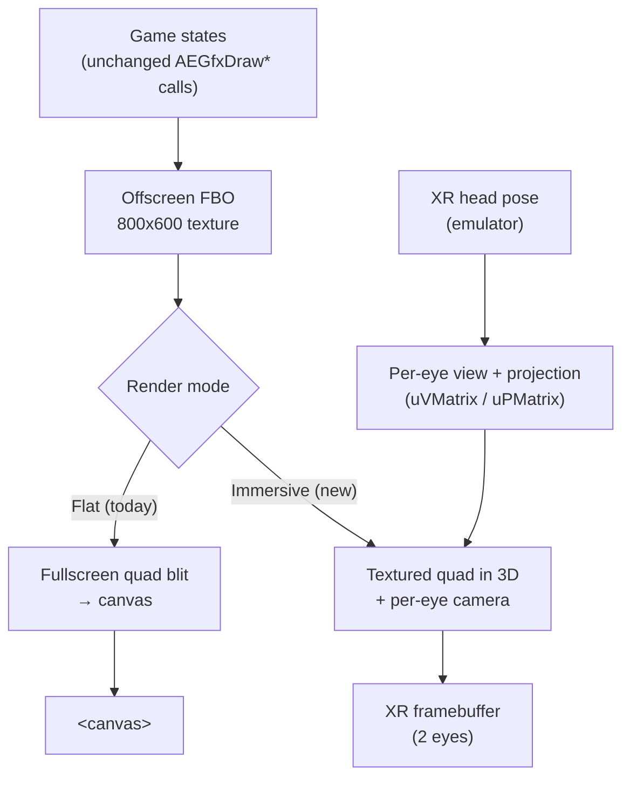

# Initial 3D Rework Against the WebXR Emulator — Scoping Report

**Subject:** What it takes to do an *initial* 3D / WebXR rework of the Alpha Engine, validated entirely against the **WebXR API Emulator** (no headset), while **keeping the existing 2D rendering fully working**.

**Audience:** Engineering, deciding whether to commit and in what order.

**Posture:** This is a constructive plan, but it keeps the skeptical framing from the architecture discussion. The goal of this phase is to *de-risk*, not to ship VR.

---

## 1. Goal and constraints

The objective of the initial rework is narrow on purpose: stand up a 3D, stereo, head-tracked render path in the browser, prove it against the emulator, and do so without regressing the 2D engine or the native Windows build. Three constraints shape every decision below.

First, **2D rendering must keep working unchanged.** Game states must be able to call the existing `AEGfxDraw*` API and get exactly today's output. We treat the 2D pipeline as a fixed contract, not something to refactor.

Second, **the work must be emulator-validatable.** Anything that genuinely needs a headset to verify (comfort, true latency, 90 Hz performance, controller ergonomics) is explicitly out of scope for this phase and deferred.

Third, **the native build must not regress.** Only the XR session/loop/pose glue is web-only; the reusable 3D rendering capability is written as ordinary GL so it compiles and runs natively too. This is the main mitigation against the "third compilation axis rots" risk flagged earlier.

---

## 2. Key finding: the GPU pipeline is already 4×4

The most important thing the code review turned up is that **the engine is far less 2D at the GPU level than the SAD implies.** The vertex shaders in `AEGraphics.cpp` already declare full 4×4 matrices and the standard transform chain:

```glsl
uniform mat4 uPMatrix;     // projection
uniform mat4 uVMatrix;     // view
uniform mat4 uWorldMatrix; // model
gl_Position = uPMatrix * uVMatrix * uWorldMatrix * aPosition;
```

and the engine already uploads them with `glUniformMatrix4fv`, with a settable viewport already present in the code (not only the fixed `glViewport(0,0,gWIN_WIDTH,gWIN_HEIGHT)` used for the 2D default). In other words, the "2D-ness" of the renderer lives in **how the CPU builds those matrices** — an orthographic projection, a trivial view, and 2D `AEMtx33` transforms promoted into the world matrix — *not* in the shader contract. The GPU side is already willing to draw 3D.

The practical consequence: stereo rendering does not require new shaders. It requires feeding the existing `uPMatrix`/`uVMatrix` uniforms a real per-eye **perspective projection** and a **view matrix derived from the XR head pose**, then drawing the scene twice (once per eye) into the XR framebuffer with the correct per-eye viewport. That is a meaningfully smaller job than "write a 3D renderer."

This was confirmed by reading the CPU-side construction, and it is even more favorable than expected: the engine already builds its view matrix with a real `MtxLookAt` and uploads `Matrix4` proj/view via a parameterized viewport. It currently uploads an **orthographic** projection — but a `MtxPerspectiveProjection(fov, aspect, near, far)` function already exists in the math layer (it is literally sitting commented-out one line above the active ortho call). So switching to a 3D camera is closer to "uncomment perspective and drive the look-at from the XR pose" than to new infrastructure. The 3D math toolkit (`Matrix4`, `Point4`, `Vector4`, `MtxLookAt`, `MtxPerspectiveProjection`, `MtxTranspose`) is already present and in use.

---

## 3. How we keep 2D working: render-to-texture panel

The lowest-risk way to honor the "2D must keep working" constraint is to **not touch the 2D path at all** and instead composite it into the 3D scene.

The existing engine renders its 800×600 2D frame to the default framebuffer. We redirect that into an **offscreen framebuffer object (FBO)** — an 800×600 texture — with zero changes to game draw code. In the flat (non-immersive) mode, that texture is blitted to the screen exactly as today (the engine already has a fullscreen-quad shader, `gl_Position = vec4(aCoords.xy,0,1)`, which is exactly the blit primitive needed). In immersive mode, that same texture is drawn on a **quad floating in the VR scene** — a virtual screen — using the 4×4 path with the XR camera.



This delivers a real, head-trackable VR result on day one — your 2D platformer rendered on a screen you can look around in the emulator — while the entire 2D engine and all game code stay byte-for-byte the same. It is also the honest scope for a 2D game: a flat game on a virtual panel is the sensible first milestone, and true 3D game geometry is a later, separate effort.

---

## 4. The real integration problems

Three things genuinely fight the current architecture. None is a showstopper for the emulator phase, but they are where the work and the risk concentrate.

**Loop ownership (the hardest one).** The web build runs on `emscripten_set_main_loop(AEGameTick, 0, 1)` — driven by the browser's `requestAnimationFrame`, with `simulate_infinite_loop = 1` unwinding the C stack. WebXR will not render through that: an immersive session has its *own* frame callback (`XRSession.requestAnimationFrame`), which is the only place you receive the head pose and the XR framebuffer, and it runs at the headset's rate, not the page's. So immersive mode cannot be driven by `emscripten_set_main_loop`; it must be driven by the XR frame callback (in practice via Emscripten's WebXR binding / the `emscripten-webxr` library, which delivers per-view projection/view matrices and the framebuffer to a C callback). The clean way to absorb this is a **mode switch**: keep `emscripten_set_main_loop` for the flat menu / pre-VR state, and hand the loop to the XR callback when an immersive session starts. The fixed-timestep accumulator (`AEUpdateFixedSteps`) is reusable inside either driver — it only needs a time delta — so the simulation logic survives; only *who calls it* changes.

**Framebuffer and viewport.** Today the engine renders to framebuffer 0 with a fixed full-window viewport. XR requires binding the session's `XRWebGLLayer` framebuffer and setting `glViewport` per eye from each `XRView`'s viewport rect, rendering the scene once per view. The engine already has a parameterized viewport call, so this is plumbing rather than redesign, but `AEGfxStart/End` and the frame orchestration in `AESystem` need an XR-aware variant.

**Camera / matrix construction.** The CPU currently builds an ortho projection and a `MtxLookAt` view. The 3D path needs (a) a 4×4 perspective projection — but the XR runtime *hands you* the projection matrix per eye, so you mostly forward it (and the engine's own `MtxPerspectiveProjection` is available as a fallback) — and (b) a view matrix from the head pose, also provided by the runtime. Because `Matrix4`/`Point4`/`Vector4`/`MtxLookAt` already exist and are used, the new math the engine must own is small: mainly a **quaternion** type for orientation (currently missing) if you build the view from pose components rather than consuming the runtime's view matrix directly. The existing math files should be consolidated and unit-tested rather than written from scratch.

---

## 5. What is in scope vs. deferred (this phase)

| Area | In scope (emulator phase) | Deferred |
|------|---------------------------|----------|
| Render | Stereo render of the 2D frame on a virtual panel; offscreen FBO; per-eye viewport | True 3D game geometry, lighting, depth scenes |
| Camera | Head pose → view matrix; runtime-supplied per-eye projection | Comfort/locomotion tuning |
| Loop | Mode switch: rAF (flat) ↔ XR frame callback (immersive); reuse fixed-timestep | — |
| Math | Consolidate `Mat4`/`Vec4`, add quaternion, unit-tested on native | Full 3D math/geometry suite |
| Input | Keep keyboard driving the game (works in the emulator) | 6DoF controllers, hand tracking |
| 2D | Unchanged API; flat-mode output identical to today | 3D-aware HUD/overlay system |
| Audio | Untouched (still stubbed on web) | Spatial audio |
| Native | Keep 3D/FBO path GL-only so it builds natively; XR glue web-only | Native XR (no native analog exists) |

Deliberately leaving controllers and real 3D content out is what makes this phase emulator-validatable and finite. The emulator's value is precisely the part we keep: session bring-up, the loop conflict, stereo rendering, and head pose.

---

## 6. Suggested milestones

| # | Milestone | Proves | Rough effort |
|---|-----------|--------|--------------|
| 0 | Throwaway WebXR spike (clear-color stereo via the Emscripten WebXR binding) | Session + XR loop work through Emscripten at all | Days |
| 1 | Offscreen FBO + flat-mode blit, output identical to today | 2D path survives redirection to a texture | Days |
| 2 | Draw the FBO texture on a quad with the existing 4×4 path (mono, on screen) | The 3D submit path and a camera work | Days |
| 3 | Immersive session: render the quad per-eye into the XR framebuffer, head-tracked, in the emulator | The whole vertical slice; the loop mode-switch | 1–2 weeks |
| 4 | `Mat4`/quaternion consolidation + unit tests; mode switch hardened; native build green | Foundations solid, no native regression | ~1 week |

Milestone 0 is the go/no-go gate; everything after it is only worth doing if 0 succeeds. Note the ordering deliberately defers the math consolidation (milestone 4) until after the conventions are known from the XR path — building it first risks picking the wrong handedness/matrix-major and redoing it (WebXR hands you column-major, right-handed matrices).

---

## 7. Code touch-points

| File | Change | Native-safe? |
|------|--------|--------------|
| `Main.cpp` | Mode switch between `emscripten_set_main_loop` and the XR frame callback; reuse `AEUpdateFixedSteps` | Web-only glue; flat path unchanged natively |
| `AESystem.cpp` | XR-aware frame start/end; session lifecycle (init/start/end); pose retrieval | Web-only, guarded |
| `AEGraphics.cpp` | Offscreen FBO + blit; XR framebuffer/viewport binding; feed per-eye `uPMatrix`/`uVMatrix`; quad-draw helper | FBO/blit/quad GL-only (native-safe); XR binding web-only |
| Math (`Matrix4`, `Vector4`, new `Quaternion`) | Consolidate, add quaternion, unit tests | Fully native-safe |
| `web/shell.html` | "Enter VR" button (must request the session from a user gesture) | Web-only |
| Build (`cmake/`) | Link the Emscripten WebXR binding; optional `AE_XR` flag | Web-only |

The guarding strategy: a single `AE_XR` (web-only) switch wraps the session/loop/pose code, while the FBO, blit, quad, and matrix work stay unguarded GL so the native build exercises them too. That keeps the web-only surface as small as possible.

---

## 8. Risks and open questions

The Emscripten WebXR story is the biggest unknown. Unlike SDL2/SDL_image/FreeType, which are first-class Emscripten ports, WebXR comes through a thinner, more community-maintained binding; milestone 0 exists specifically to find out whether it behaves in *this* toolchain before anything depends on it. Second, the loop mode-switch touches the most load-bearing part of the current design (the single fixed-timestep loop), so it deserves careful handling and a clean fallback to flat mode. Third, the "GPU is already 4×4" finding needs confirmation by reading the CPU-side matrix construction — the report's cost estimate leans on it. Finally, the honest conceptual caveat stands: this produces a 2D game on a virtual screen, which is a legitimate and demoable result, but it is *not* a 3D VR game; that remains a much larger, separate effort and should not be smuggled into this phase's expectations.

What the emulator will and will not tell you bounds the whole exercise: it validates API plumbing, the loop conflict, the stereo render path, and head-pose math — roughly 90% of this phase — but it cannot speak to comfort, real latency, sustained 90 Hz on headset-class hardware, or controller feel. Those require a device (a Meta Quest loads your GitHub Pages URL directly) and belong to a later phase.

---

## 9. Bottom line

The initial 3D rework against the emulator is **feasible and finite if scoped to a head-tracked virtual panel**, and it is *less* invasive than the SAD's 2D framing suggested, because the shader pipeline is already 4×4. The real cost is concentrated in the loop mode-switch and the XR session glue, not in the renderer. The 2D capability is preserved cleanly — and for free at the game-code level — by rendering it to an offscreen texture and compositing it, which doubles as the flat-mode path. Commit only after the milestone 0 spike confirms the Emscripten WebXR binding works in your toolchain.

---

*Sources: derived from the codebase — `AEGraphics.cpp` (4×4 shaders, `glUniformMatrix4fv`, viewport), `Main.cpp` (`emscripten_set_main_loop`, fixed-timestep), `AESystem.cpp` (SDL window/GL, frame orchestration), the math files, and `cmake/`. WebXR/Emscripten behavior reflects general platform knowledge and should be confirmed by the milestone 0 spike.*
